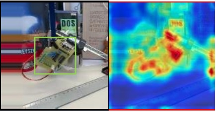
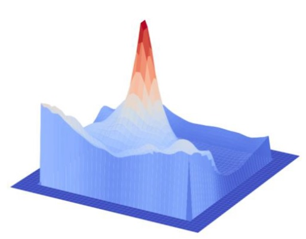

# visualization_tools
visualization tools for cnns and tracking

## visualize heatmaps
#### heatmap2D(a 2D matrix response add with origin image). [[code]](heatmap_tools/Heatmap.py)

    

#### heatmap3D(a 2D matrix response add with origin image). [[code]](heatmap_tools/ResponseMap3D.py)

    

