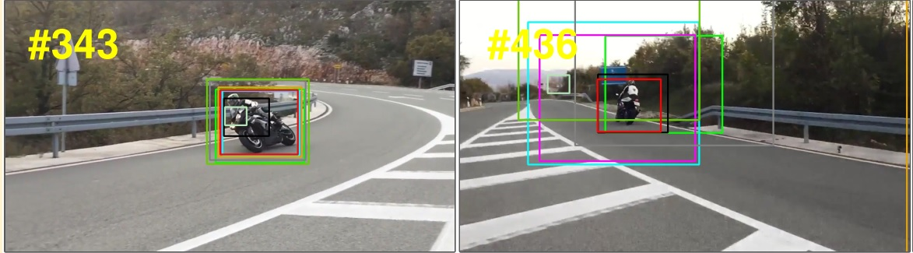

# visualization_tools
visualization tools for cnns and tracking

## visualize heatmaps
#### heatmap2D (a 2D matrix response add with origin image). [[code]](heatmap_tools/Heatmap.py)

    

#### heatmap3D (a 2D matrix response). [[code]](heatmap_tools/ResponseMap3D.py)

    

## visual tracking tools

#### view tracking bboxes from txt result(as a qualitative compare of trackers). [[code]](visual_tracking_tools/viewbbox.py)

    

## plot tools

#### draw a 2d plot, e.g. ACC v.s. Parameter. [[code]](plot_tools/acc_vs_param.m)

    

