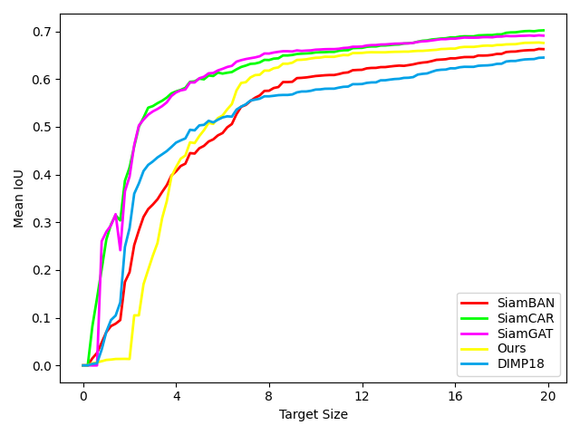
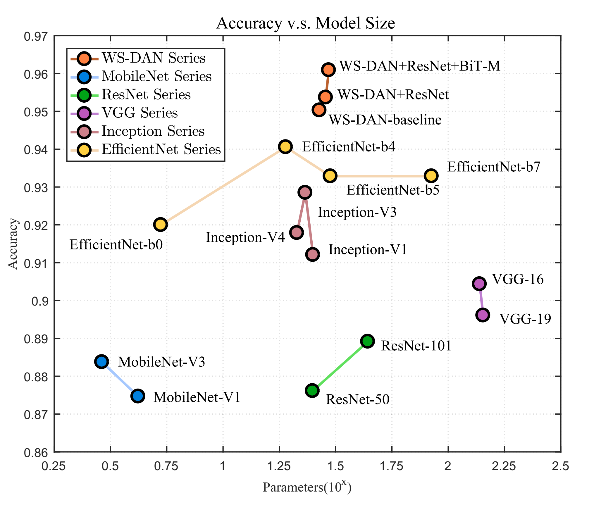

# Visualization_tools
Visualization tools for cnns and tracking

## Visualize heatmaps
#### heatmap2D (a 2D matrix response add with origin image). [[code]](heatmap_tools/Heatmap.py)

    

#### heatmap3D (a 2D matrix response). [[code]](heatmap_tools/ResponseMap3D.py)

    

## Visual tracking tools

#### View tracking bboxes from txt result (as a qualitative compare of trackers). [[code]](visual_tracking_tools/viewbbox.py)

    

#### Tracking IoU vs target size (result txts). [[code]](visual_tracking_tools/IoU_vs_targetsize/IoU_Count.py)

    

## Plot tools

#### Draw a 2D plot, e.g. ACC v.s. Parameter. [[code]](plot_tools/acc_vs_param.m)

The label may need fine-tune manually by pdf editer like Acrobat.

    

